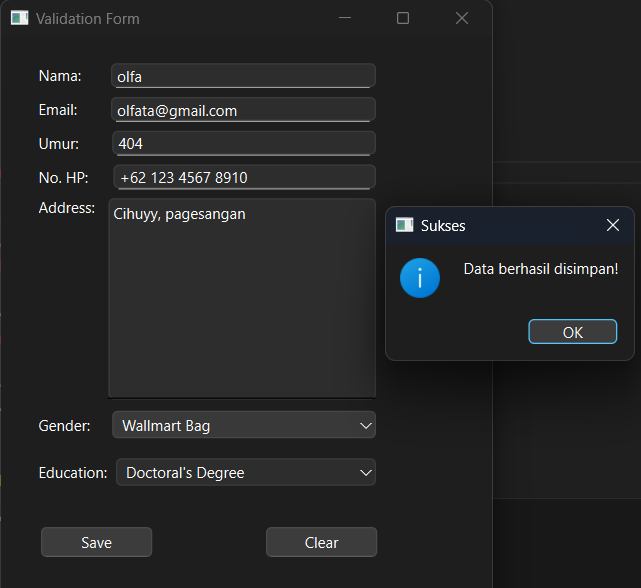
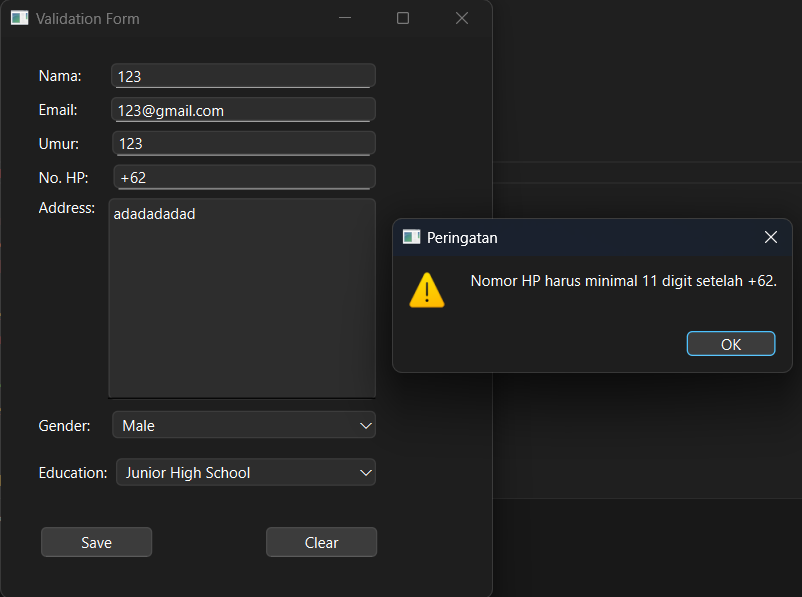

# pv25-week5

Validation Form

Dengan beberapa fitur seperti:

1. Name Field: Field untuk mengisi nama
2. Email Field: Field untuk mengisi email dengan format tertentu, harus mengisi @gmail kemudian diikuti dengan .com
3. Age Field: Field untuk mengisi umur dengan maks 3 digit, dengan ketentuan harus berupa nilai numerik
4. Phone Number Field: Field untuk mengisi no HP dengan default awal yaitu +62, disertai dengan ketentuan harus sepanjang 13 digit termasuk +62 nya, jadi 11 digit setelah +62.
5. Address Field: Field untuk mengisi alamat
6. Gender Combo Box: Box yang memuat beberapa gender, diantaranya Male, Female, dan Wallmart Bag.
7. Education Combo Box: Box yang memuat beberapa opsi terkait jenjang pendidikan saat ini, dimulai dari Elementary School hingga Doctoral's Degree.
8. Save Button: Push button yang digunakan untuk melakukan penyimpanan data
9. Clear Button: Push button yang digunakan untuk clear/membersihkan seluruh form baik pada field ataupun combo box.

Tampilan program saat validasi berhasil:

Tampilan program saat validasi gagal:

